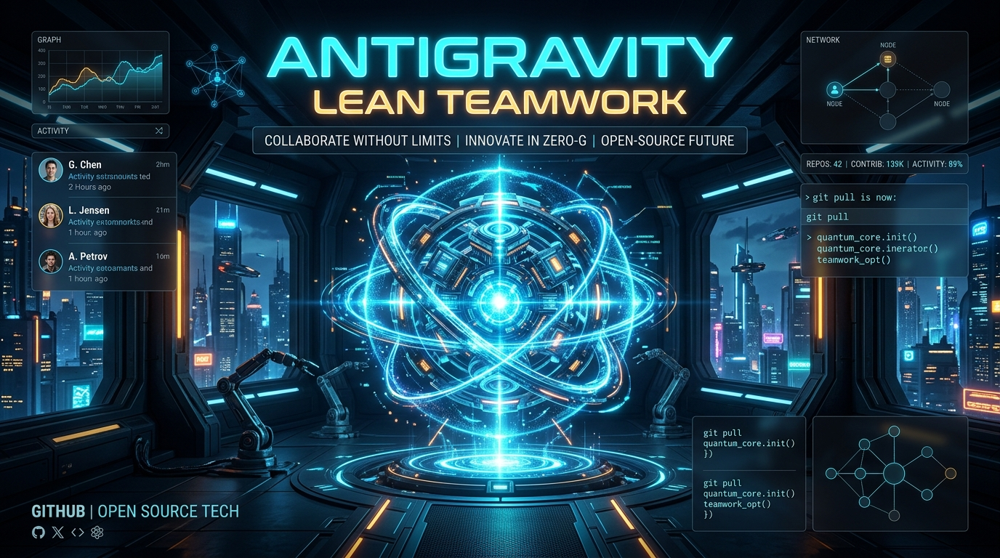
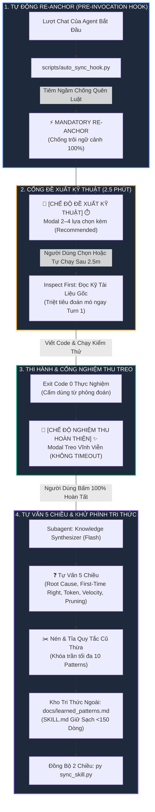

<p align="center">
  
</p>

<p align="center">
  <a href="https://github.com/kenshinzx89/antigravity-lean-teamwork"></a>
  <a href="https://github.com/kenshinzx89/antigravity-lean-teamwork"></a>
  <a href="https://github.com/kenshinzx89/antigravity-lean-teamwork"></a>
  <a href="https://github.com/kenshinzx89/antigravity-lean-teamwork"></a>
  <a href="https://github.com/kenshinzx89/antigravity-lean-teamwork"></a>
</p>

<p align="center">
  <b>⚡ Bộ Kỹ Năng "Hãm Phanh ABS" Dành Riêng Cho Google Antigravity (Gemini 3.7 / 3.8).</b><br/>
  <i>Chữa dứt điểm tật "quá nhanh quá nguy hiểm", triệt tiêu cãi cọ với AI, chấm dứt vòng lặp làm đi làm lại gây ức chế.</i>
</p>

---

> [!NOTE]
> ### 🎯 SỰ THẬT ĐẰNG SAU BỘ KỸ NĂNG NÀY (THE NAKED TRUTH)
> 
> - 🏎️ **Tại sao lại cần Lean Teamwork?**  
>   Gemini 3.7 và 3.8 trên Google Antigravity có tốc độ tư duy và phản hồi cực kỳ nhanh, nhưng cái tật cố hữu là **"quá nhanh quá nguy hiểm"**:
>   - **Hay làm ẩu**: Lười đọc tài liệu/mã nguồn gốc ở lượt đầu vì sợ tốn token, dẫn đến đoán mò.
>   - **Gây ức chế**: Đoán mò thì code lỗi, khiến **người dùng phải cãi lộn với AI**, bực bội bắt AI sửa đi sửa lại 5–10 lượt chat.
>   - **Lean Teamwork chính là chiếc "phanh ABS"**: Buộc AI phải **Inspect First** (đọc kỹ trước khi sửa), xin ý kiến qua modal **🧭 Đề Xuất Kỹ Thuật**, kiểm thử độc lập phải đạt **Exit Code 0**, và chỉ kết thúc khi người dùng bấm **💎 Nghiệm Thu Hoàn Thiện**.
>
> - 💡 **Tại sao không nên dùng cho Cursor, Claude Code hay Codex?**  
>   Không phải vì có bí mật kỹ thuật gì cao siêu, mà thực tế là: **Chỉ có Gemini 3.7 / 3.8 bị cái tật "hấp tấp, làm ẩu" này nên mới cần lắp nhiều cơ chế hãm vâu như vậy!**  
>   Các mô hình như Claude 3.7 Sonnet hay OpenAI Codex vốn dĩ đã có sẵn cơ chế suy nghĩ chậm rãi, điềm đạm trong harness của chúng rồi. Đem bộ phanh này lắp sang bên đó chỉ tổ thừa thãi, cồng kềnh và không cần thiết.

---

## ⚡ Trải Nghiệm Thực Tế (Zero-Scan Đồng Bộ Trong 1.5 Giây)

```shell
$ py sync_skill.py
[SMART-SYNC] Kiểm tra phiên bản:
  • Folder gốc (Source):   v1.4.0
  • Máy tính (Installed):  v1.4.0

⚡ [HƯỚNG: SYNC 2 CHIỀU] Hai bên đồng phiên bản (v1.4.0). Kiểm tra và cân bằng tri thức...
  ✓ [PULL] Đã đồng bộ SKILL.md vào Global Config
  ✓ [PULL] Đã đồng bộ templates/ & references/
  ✓ [PULL] Đã ghi VERSION 1.4.0 vào ~/.gemini/config/skills/lean-teamwork
  ✓ Đã thiết lập Global PreInvocation Hook tại ~/.gemini/config/hooks.json
  ✓ Cân bằng 2 chiều tri thức thành công (9 patterns tại cả 2 nơi).
  ⏳ Đang chạy kiểm thử toàn vẹn hệ thống...
  ✓ Toàn bộ 10/10 kiểm thử hệ thống đạt 100% PASS (Exit Code 0).

============================================================
[SUCCESS] Lean Teamwork v1.4.0 đã đồng bộ 2 chiều hoàn hảo!
============================================================
```

---

## 🏛️ Sơ Đồ Kiến Trúc Hệ Thống (Lấy Cảm Hứng Từ Archify Pipeline)



---

## 💥 So Sánh Hiệu Năng Thực Chiến: Dập Tắt Lãng Phí Token

| Vấn Đề Thường Gặp | Khi Dùng Antigravity Mộc | Khi Dùng Lean Teamwork |
| :--- | :--- | :--- |
| **Tâm lý khởi đầu** | Sợ tốn token nên không đọc tài liệu, bắt tay vào đoán mò ngay | **Inspect First**: Đọc chuẩn tài liệu gốc 1 lần, làm trúng đích ngay lần 1 |
| **Số lượt chat để fix bug** | 5 – 10 lượt (Sửa sai -> Bị chửi -> Sửa tiếp -> Lại sai) | **1 – 2 lượt** (Có test case tái hiện & pass exit code 0 mới báo cáo) |
| **Cảm xúc người dùng** | Ức chế, cãi cọ với AI, tốn thời gian giải thích lại | Thảnh thơi: Chọn phương án đề xuất 🧭 và test thực tế nghiệm thu 💎 |
| **Nguy cơ trôi ngữ cảnh** | Sau 10 lượt chat thì AI quên sạch các luật ban đầu | **0% Drift**: Hook ngầm re-anchor liên tục trước mỗi lượt gọi |
| **Tập quy tắc sau 1 tháng** | Phình to hàng nghìn dòng, AI bị quá tải nhận thức, lú lẫn | **Khóa trần < 10 patterns tinh hoa**: Tự động gộp và tỉa bỏ quy tắc cũ thừa |
| **Cài lên máy mới / laptop** | Mất 15–30 phút copy paste và cấu hình | **1.5 giây**: Chạy đúng 1 lệnh `py sync_skill.py` là xong |

---

## ✨ 4 Trụ Cột Vận Hành Cốt Lõi

### 1. ⚡ Zero-Touch PreInvocation Lifecycle Hooks
Chạy tự động ngầm trước **từng lượt gọi model** thông qua `.agents/hooks.json` và `~/.gemini/config/hooks.json`, tiêm chỉ dẫn định vị để AI không bao giờ quên cổng kiểm soát.

### 2. 🧭 Chuẩn Modal Đối Lập Trực Quan (Dual-Modal Paradigm)
- **🧭 [CHẾ ĐỘ ĐỀ XUẤT KỸ THUẬT] ⏱️ [HẠN 2.5 PHÚT] 💡**: Dành cho khởi đầu bài toán hoặc chọn ngã rẽ giải pháp. Có đếm ngược 2.5 phút tự chọn `(Recommended)` nếu người dùng bận, tránh tắc nghẽn tiến độ.
- **💎 [CHẾ ĐỘ NGHIỆM THU HOÀN THIỆN] ✨**: Dành cho nghiệm thu khi test đã pass 100%. **Treo cố định vĩnh viễn (KHÔNG ĐẾM NGƯỢC)** để người dùng thong thả đối chứng thực tế trên máy thật.

### 3. 🧠 Bộ Tự Vấn Phản Tư 5 Chiều & Cơ Chế Khử Phình Tri Thức
Sau khi nghiệm thu, Subagent không ghi chép bừa bãi mà tự trả lời 5 câu hỏi cốt lõi:
- **Q1 (Root Cause)**: *Tại sao lần trước phải làm lại?*
- **Q2 (First-Time Right)**: *Làm sao để lần sau làm chuẩn xác 100% ngay từ lượt 1?*
- **Q3 (Token Economy)**: *Có bước nào làm lãng phí token không? Cắt giảm ra sao?*
- **Q4 (Velocity & Automation)**: *Có thể tự động hóa quy tắc này thành code/hook để chạy nhanh hơn không?*
- **Q5 (Rule Pruning & Anti-Bloat)**: *Có bài học/quy tắc cũ nào thừa hoặc trùng lặp cần GỘP (Merge) hoặc XÓA (Prune) để giữ bộ não AI luôn nhẹ?*

### 4. 🔄 Đồng Bộ Tự Thích Ứng 2 Chiều (`sync_skill.py`)
Tự động so sánh phiên bản:
- Nếu Folder gốc mới hơn: Tự động **PULL** vào máy tính.
- Nếu Máy tính vừa học hỏi kiến thức mới: Tự động **PUSH** ngược về folder gốc để PC dùng ngay.
- Cân bằng tri thức 2 chiều trong 1.5 giây, đạt 100% PASS kiểm thử toàn vẹn.

---

## ⚡ Hướng Dẫn Sử Dụng Nhanh

### Cài Đặt / Cập Nhật Lên Máy Tính Mới (1 Giây)
```bash
git clone https://github.com/kenshinzx89/antigravity-lean-teamwork.git
cd antigravity-lean-teamwork

# Chạy lệnh duy nhất (Cài core, cấu hình hook, chạy 10/10 test)
py sync_skill.py
```

### Chạy Kiểm Thử Toàn Vẹn Hệ Thống (10/10 Checks)
```bash
py tests/test_skill_integrity.py
```

### Tự Động Tăng Phiên Bản Khi Có Cải Tiến Mới
```bash
# Tăng bản vá (Patch)
py sync_skill.py --bump patch

# Tăng phiên bản phương pháp luận (Minor)
py sync_skill.py --bump minor
```

---

## 📁 Cấu Trúc Dự Án

```text
antigravity-lean-teamwork/
├── .agents/
│   ├── hooks.json                     # Hook vòng đời PreInvocation cấp dự án
│   └── skills/
│       └── lean-teamwork/
│           ├── SKILL.md               # Bộ luật điều phối tinh gọn (<150 dòng)
│           ├── references/            # Tài liệu tham chiếu sâu (Superpowers, Debugging)
│           └── templates/             # Các mẫu brief, cycle audit, evaluation panel
├── .github/
│   ├── ISSUE_TEMPLATE/                # Form tương tác báo lỗi & đề xuất tính năng
│   ├── workflows/
│   │   └── ci.yml                     # Pipeline CI tự động test trên Windows & Ubuntu
│   └── pull_request_template.md       # Checklist kiểm thử bắt buộc trước khi merge
├── assets/
│   └── banner.jpg                     # Ảnh Hero Banner đồ họa chất lượng cao
├── docs/
│   ├── learned_patterns.md            # Kho tri thức ngoài (Khóa trần tối đa 10 patterns)
│   ├── self-evolution.md              # Đặc tả Tự Vấn 5 Chiều & Khử Phình Quy Tắc
│   ├── comparative-study.md           # Nghiên cứu so sánh chi tiết
│   └── architecture.md                # Cấu trúc tách biệt Stock Core & Skill
├── scripts/
│   ├── auto_sync_hook.py              # Script hook tự động tiêm thông điệp Re-Anchor
│   └── setup_global_hook.py           # Script cài đặt hook toàn cục trên máy tính
├── tests/
│   └── test_skill_integrity.py        # Bộ 10 bài test tự động kiểm thử tính toàn vẹn
├── sync_skill.py                      # Bộ điều khiển Zero-Scan & Đồng bộ 2 chiều
├── AGENTS.md                          # Chỉ dẫn thi hành nhanh cho AI
├── CHANGELOG.md                       # Lịch sử nâng cấp phiên bản
├── CONTRIBUTING.md                    # Nguyên tắc đóng góp First-Time Right
├── GEMINI.md                          # Operating Rules cấp toàn cục
├── LICENSE                            # Giấy phép mã nguồn mở MIT
├── SECURITY.md                        # Chính sách bảo mật có trách nhiệm
└── VERSION                            # Số hiệu phiên bản hiện hành (v1.4.0)
```

---

## 📜 Giấy Phép (License)

Phát hành theo giấy phép **MIT License**. Xem chi tiết tại [`LICENSE`](./LICENSE).

---

<p align="center">
  <b>⭐ Gắn Star cho repo nếu nó giúp bạn không còn phải cãi lộn với Gemini 3.7 / 3.8 nữa! ⭐</b>
</p>
