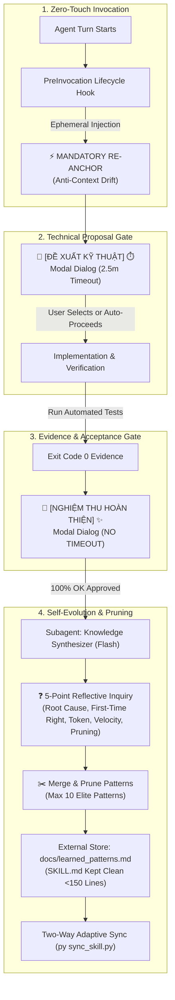

# ⚡ Antigravity Lean Teamwork

<p align="center">
  <a href="https://github.com"></a>
  <a href="https://github.com"></a>
  <a href="https://github.com"></a>
  <a href="https://github.com"></a>
  <a href="https://github.com"></a>
  <a href="https://github.com"></a>
</p>

> **An ultra-lean, token-disciplined, autonomous multi-agent orchestration framework for Google Antigravity & Claude Code.**  
> Eliminates context drift, crushes runaway token consumption, prevents rule bloat, and self-evolves across sessions with zero manual scans.

---

## 🚀 The Core Problem Solved

Traditional AI agent workflows suffer from four fatal failure modes:
1. **Unbounded Context Burn (Token Waste)**: Agents blindly scan large repositories, dumping thousands of lines into the context window at turn 1.
2. **Context Drift**: Agents forget operational instructions mid-flight when session history exceeds tens of thousands of tokens.
3. **The "Blind Lean" Paradox**: Forbidding agents from reading documentation to "save tokens" results in blind guessing, creating a 5–10 turn debugging churn that consumes 5x more tokens.
4. **Rule Bloat (Cognitive Overload)**: Appending every bugfix into the core system prompt causes rule explosion, paralyzing model reasoning.

**Lean Teamwork** introduces an uncompromising operating discipline combining **Superpowers Systematic Debugging**, **Zero-Touch Lifecycle Hooks**, **Two-Way Adaptive Sync**, and **5-Point Reflective Inquiry with Continuous Knowledge Pruning**.

---

## 🏛️ System Architecture



---

## ✨ 5 Key Innovations

### 1. ⚡ Zero-Touch PreInvocation Lifecycle Hooks
- Runs stealthily before **every single model turn** via `.agents/hooks.json` and `~/.gemini/config/hooks.json`.
- Injects an ephemeral re-anchor message to maintain 100% adherence to gates without polluting persistent chat history.

### 2. 🧭 Dual-Modal Paradigm (Contrasting UI Modes)
- **🧭 [CHẾ ĐỘ ĐỀ XUẤT KỸ THUẬT] ⏱️ [HẠN 2.5 PHÚT] 💡**: Used for architecture and solution trade-offs. Features 2–4 options with a `(Recommended)` path. Automatically proceeds if user is busy to prevent pipeline stalls.
- **💎 [CHẾ ĐỘ NGHIỆM THU HOÀN THIỆN] ✨**: Used when code is verified with exit code 0. Has strictly two options (`100% Hoàn Tất` vs `Superpowers Debug`). **Permanently suspended without timeout** until user validates in their live environment.

### 3. 🧠 5-Point Reflective Inquiry & Continuous Knowledge Pruning
Instead of blindly appending rules after acceptance, the Synthesizer Subagent investigates:
- **Q1 (Root Cause & Churn)**: *Why did any steps fail or require retries?*
- **Q2 (First-Time Right)**: *How can Lean Teamwork achieve 100% precision on turn 1?*
- **Q3 (Token Economy)**: *Which steps burned unnecessary tokens? How to prune context?*
- **Q4 (Velocity & Automation)**: *Can this rule be automated into a Python script or hook?*
- **Q5 (Rule Pruning & Anti-Bloat)**: *Which obsolete or duplicate rules should be merged or pruned?*

### 4. 🛡️ Knowledge Segregation
- **`SKILL.md` is strictly orchestration logic (<150 lines)**: Never contaminated with bug logs or domain snippets.
- **Learned patterns live externally**: Stored in `docs/learned_patterns.md` and indexed by `[Tag]`. Agents retrieve patterns on-demand via targeted grep queries rather than bulk context injection.

### 5. 🔄 Two-Way Adaptive Sync (`sync_skill.py`)
- Automatically compares versions between Source Repository and Machine Global Core (`~/.gemini/config/skills/lean-teamwork`).
- Automatically **PULLS** updates to fresh machines or **PUSHES** new learnings back to the source repo.
- Synchronizes knowledge bidirectionally and enforces 100% test pass rates in under 2 seconds.

---

## ⚡ Quick Start

### 1-Second Setup (New Machine or Existing)
No recursive scans or manual setup needed:

```bash
# Clone the repository
git clone https://github.com/your-username/antigravity-lean-teamwork.git
cd antigravity-lean-teamwork

# Run Two-Way Adaptive Sync (Installs core, hooks, and tests in ~1.5s)
python sync_skill.py
```

### Run System Integrity Suite (10/10 Tests)
```bash
python tests/test_skill_integrity.py
```

### Self-Evolution Version Bumping
```bash
# Bump patch version and sync immediately
python sync_skill.py --bump patch

# Bump minor version (major methodology change)
python sync_skill.py --bump minor
```

---

## 📁 Repository Structure

```text
antigravity-lean-teamwork/
├── .agents/
│   ├── hooks.json                     # Workspace PreInvocation lifecycle hook
│   └── skills/
│       └── lean-teamwork/
│           ├── SKILL.md               # Clean, immutable orchestration rules (<150 lines)
│           ├── references/            # Deep architectural and debugging guides
│           └── templates/             # Execution brief, cycle reflection, and panel templates
├── .github/
│   └── workflows/
│       └── ci.yml                     # Multi-OS CI pipeline (Ubuntu, Windows / Python 3.10-3.12)
├── docs/
│   ├── learned_patterns.md            # External consolidated knowledge store (Max 10 patterns)
│   ├── self-evolution.md              # 5-Point Inquiry, Anti-Survivorship Bias, and Pruning spec
│   ├── comparative-study.md           # Deep benchmark vs Hermes, Superpowers & OpenClaw
│   └── architecture.md                # System topology and separation of concerns
├── scripts/
│   ├── auto_sync_hook.py              # Zero-Touch workspace preinvocation hook
│   └── setup_global_hook.py           # Installer for global machine lifecycle hook
├── tests/
│   └── test_skill_integrity.py        # 10/10 Automated system integrity test suite
├── sync_skill.py                      # Two-Way Adaptive Sync & Zero-Scan controller
├── AGENTS.md                          # Fast-sync instructions for autonomous agents
├── CHANGELOG.md                       # Comprehensive version progression history
├── CONTRIBUTING.md                    # Engineering principles and PR guidelines
├── GEMINI.md                          # Global operating rules & controller
├── LICENSE                            # MIT License
└── VERSION                            # Canonical semantic version file (v1.4.0)
```

---

## 🏆 Benchmark & Token Efficiency

| Metric | Unstructured Agents | Stock Gemini / Claude | Antigravity Lean Teamwork |
| :--- | :---: | :---: | :---: |
| **Initial Turn Context** | 30k – 60k tokens | 15k – 25k tokens | **< 3k tokens** (Zero-Scan) |
| **Turns per Simple Defect** | 4 – 8 turns | 2 – 4 turns | **1 – 2 turns** (First-Time Right) |
| **Context Drift over 10 Turns** | Frequent | Occasional | **0%** (Re-Anchor Hook) |
| **Rule Bloat Over Time** | Unbounded growth | Manual prompt edits | **Constant (<10 patterns)** |
| **New Machine Onboarding** | 10 – 30 minutes | Manual copy-paste | **1.5 seconds (`py sync_skill.py`)** |

---

## 📜 License

Distributed under the **MIT License**. See [`LICENSE`](./LICENSE) for more information.
