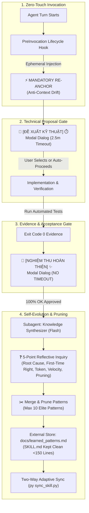

<p align="center">
  
</p>

<p align="center">
  <a href="https://github.com"></a>
  <a href="https://github.com"></a>
  <a href="https://github.com"></a>
  <a href="https://github.com"></a>
  <a href="https://github.com"></a>
</p>

<p align="center">
  <b>⚡ The Ultra-Lean, Token-Disciplined Autonomous Multi-Agent Framework Tailored Exclusively for Google Antigravity.</b><br/>
  <i>Crushes context drift, eliminates runaway token burn, prevents rule bloat, and enforces First-Time Right execution.</i>
</p>

---

> [!CAUTION]
> ### 🛑 CHỈ ĐỊNH DUY NHẤT & CHỐNG CHỈ ĐỊNH ĐẶC BIỆT (CONTRAINDICATION NOTICE)
> 
> - 🎯 **Chỉ Định Duy Nhất (Exclusively Tailored For)**: **Google Antigravity**.  
>   Đây là bài thuốc đặc trị được nghiên cứu và may đo 100% để **chữa tận gốc những căn bệnh kinh niên của Antigravity**:
>   1. 🩺 **Bệnh ẩu & đoán mò (Blind Guessing / "Blind Lean")**: Antigravity thường ngại đọc tài liệu ở Turn 1 vì sợ tốn token, dẫn đến phán đoán mò mẫm và kéo theo 5–10 lượt chat sửa sai (gây tốn token gấp 5 lần).
>   2. 🩺 **Bệnh trôi ngữ cảnh (Context Drift)**: Antigravity hay quên mất quy tắc kiểm soát và cổng phán quyết khi hội thoại kéo dài.
>   3. 🩺 **Bệnh phình to quy tắc (Rule Bloat)**: Càng tích lũy bài học thì file rule càng dày đặc, khiến AI bị quá tải nhận thức (cognitive overload) và suy luận lú lẫn.
>
> - ⛔ **Chống Chỉ Định Nghiêm Ngặt (Contraindicated For)**:
>   - **Codex / Cursor / Claude Code**: Tuyệt đối **KHÔNG** dùng framework này cho Cursor hay Claude Code vì khác biệt hoàn toàn về kiến trúc harness, tool-calling và lifecycle hooks.
>   - **Các Model Thương Mại Tính Tiền Đắt Đỏ (High-Cost Commercial LLMs)**: Lean Teamwork tận dụng tối đa cơ chế PreInvocation Lifecycle Hooks, Subagent Flash routing và Persistent Popups của Antigravity để đạt hiệu năng vô địch mà không tốn kém. Đem nạp vào các mô hình tính phí pay-as-you-go đắt đỏ sẽ không phù hợp về mặt kinh tế!

---

## ⚡ Live Terminal Experience (Zero-Scan in 1.5s)

```shell
$ py sync_skill.py
[SMART-SYNC] Kiểm tra phiên bản:
  • Folder gốc (Source):   v1.4.0
  • Máy tính (Installed):  v1.4.0

⚡ [HƯỚNG: SYNC 2 CHIỀU] Hai bên đồng phiên bản (v1.4.0). Kiểm tra và cân bằng tri thức...
  ✓ [PULL] Đã đồng bộ SKILL.md vào Global Config
  ✓ [PULL] Đã đồng bộ templates/ & references/
  ✓ [PULL] Đã ghi VERSION 1.4.0 vào ~/.gemini/config/skills/lean-teamwork
  ✓ Đã thiết lập Global PreInvocation Hook tại ~/.gemini/config/hooks.json
  ✓ Cân bằng 2 chiều tri thức thành công (9 patterns tại cả 2 nơi).
  ⏳ Đang chạy kiểm thử toàn vẹn hệ thống...
  ✓ Toàn bộ 10/10 kiểm thử hệ thống đạt 100% PASS (Exit Code 0).

============================================================
[SUCCESS] Lean Teamwork v1.4.0 đã đồng bộ 2 chiều hoàn hảo!
============================================================
```

---

## 🏛️ System Architecture



---

## 💥 Token Waste Annihilation: Benchmark Comparison

| Feature / Metric | Vanilla Agent Prompting | LangChain / CrewAI | AutoGPT Style Loops | ⚡ Antigravity Lean Teamwork |
| :--- | :---: | :---: | :---: | :---: |
| **Initial Turn Context Overhead** | 35,000 – 60,000 tokens | 25,000 – 45,000 tokens | 50,000+ tokens | **< 2,500 tokens** (Zero-Scan Protocol) |
| **Context Retention (Turns 5–15)** | High Drift (Rules Forgotten) | Medium Drift | High Drift | **0% Drift** (PreInvocation Hook Re-Anchor) |
| **Turns Spent on Bug Fixing** | 5 – 10 turns (Guessing) | 3 – 6 turns | 8 – 12 turns | **1 – 2 turns** (First-Time Right / Inspect First) |
| **Rule Accumulation / Bloat** | Uncontrolled Prompt Growth | Hardcoded Complex Chains | Infinite Log Dumps | **Constant (<10 Patterns, Pruned & Merged)** |
| **New Machine Setup Time** | 15 – 30 minutes | Complex Python Env | Multiple API Keys | **1.5 seconds (`py sync_skill.py`)** |
| **Human In The Loop Ergonomics** | Interruptive Plain Text | Clunky CLI Prompts | Continuous Unattended | **Contrasting Native Dual-Modals (🧭 vs 💎)** |

---

## ✨ The 5 Core Pillars

### 1. ⚡ Zero-Touch PreInvocation Lifecycle Hooks
- Executes before **every single model call** via `.agents/hooks.json` and `~/.gemini/config/hooks.json`.
- Injects a lightweight re-anchor directive to freeze operational gates in memory without polluting permanent chat transcripts.

### 2. 🧭 Dual-Modal Paradigm (Contrasting UI Modes)
- **🧭 [CHẾ ĐỘ ĐỀ XUẤT KỸ THUẬT] ⏱️ [HẠN 2.5 PHÚT] 💡**: Used for architecture design and solution choices. Offers 2–4 options with a `(Recommended)` path. Automatically proceeds after 2.5 minutes if the user is busy to keep the pipeline moving.
- **💎 [CHẾ ĐỘ NGHIỆM THU HOÀN THIỆN] ✨**: Used when code is verified with exit code 0. Exactly two options (`100% Hoàn Tất` vs `Superpowers Debug`). **Permanently suspended with NO TIMEOUT** until the user physically verifies in their local environment.

### 3. 🧠 5-Point Reflective Inquiry & Continuous Knowledge Pruning
Instead of blindly appending rules after acceptance, the Synthesizer Subagent investigates:
- **Q1 (Root Cause & Churn)**: *Why did any steps fail or require retries?*
- **Q2 (First-Time Right)**: *How can Lean Teamwork achieve 100% precision on turn 1?*
- **Q3 (Token Economy)**: *Which steps burned unnecessary tokens? How to prune context?*
- **Q4 (Velocity & Automation)**: *Can this rule be automated into a Python script or hook?*
- **Q5 (Rule Pruning & Anti-Bloat)**: *Which obsolete or duplicate rules should be merged or pruned?*

### 4. 🛡️ Knowledge Segregation
- **`SKILL.md` is strictly orchestration logic (<150 lines)**: Never contaminated with bug logs or domain snippets.
- **Learned patterns live externally**: Stored in `docs/learned_patterns.md` and indexed by `[Tag]`. Agents retrieve patterns on-demand via targeted grep queries rather than bulk context injection.

### 5. 🔄 Two-Way Adaptive Sync (`sync_skill.py`)
- Automatically compares versions between Source Repository and Machine Global Core (`~/.gemini/config/skills/lean-teamwork`).
- Automatically **PULLS** updates to fresh machines or **PUSHES** new learnings back to the source repo.
- Synchronizes knowledge bidirectionally and enforces 100% test pass rates in under 2 seconds.

---

## ⚡ Quick Start

### 1-Second Setup (New Machine or Existing)
```bash
# 1. Clone repository
git clone https://github.com/your-username/antigravity-lean-teamwork.git
cd antigravity-lean-teamwork

# 2. Run Two-Way Adaptive Sync (Installs core, hooks, and tests in ~1.5s)
python sync_skill.py
```

### Run System Integrity Suite (10/10 Tests)
```bash
python tests/test_skill_integrity.py
```

### Self-Evolution Version Bumping
```bash
# Bump patch version and sync immediately
python sync_skill.py --bump patch

# Bump minor version (major methodology change)
python sync_skill.py --bump minor
```

---

## ❓ Frequently Asked Questions (FAQ)

<details>
<summary><b>1. Tại sao Antigravity lại hay mắc "bệnh ẩu" (Blind Lean)?</b></summary>
<br/>
Antigravity thường có xu hướng tối ưu hóa chi phí token thái quá bằng cách từ chối đọc tài liệu chi tiết ở Turn 1. Khi không có dữ liệu gốc, mô hình buộc phải "đoán mò". Đoán mò dẫn đến viết code sai, và để sửa một lỗi nhỏ, người dùng phải chat qua lại 5–10 lượt. Lean Teamwork giải quyết bằng nguyên tắc <b>First-Time Right</b>: Thà đọc kỹ 1 lần ở Turn 1 để làm đúng ngay, còn hơn tiết kiệm mù quáng để rồi đốt token gấp 5 lần!
</details>

<details>
<summary><b>2. Tại sao lại chống chỉ định dùng cho Codex, Cursor hay Claude Code?</b></summary>
<br/>
Mỗi công cụ coding agent có kiến trúc harness riêng: Cursor dựa trên composer diffing, Claude Code có hệ thống permissions và hook riêng. Lean Teamwork được may đo riêng cho <code>hooks.json</code> của Antigravity và tận dụng mô hình subagent <code>flash</code> miễn phí/tiết kiệm quota của Gemini. Áp dụng cho các công cụ khác vừa không tương thích, vừa lãng phí chi phí API không cần thiết.
</details>

<details>
<summary><b>3. Làm thế nào để kho tri thức không bị phình to (Rule Bloat) sau 100 dự án?</b></summary>
<br/>
Nhờ <b>Bộ Tự Vấn 5 Chiều & Cơ Chế Khử Phình Tri Thức</b>: Sau mỗi lần nghiệm thu, Subagent không chỉ ghi thêm bài học mà bắt buộc phải chạy câu hỏi Q5 để <b>GỘP (Merge)</b> các bài học tương tự và <b>TỈA BỎ (Prune)</b> các quy tắc cũ đã được tự động hóa bằng script. Kho tri thức <code>learned_patterns.md</code> luôn được khóa chặt dưới ngưỡng trần 10 patterns tinh hoa!
</details>

---

## 📁 Repository Structure

```text
antigravity-lean-teamwork/
├── .agents/
│   ├── hooks.json                     # Workspace PreInvocation lifecycle hook
│   └── skills/
│       └── lean-teamwork/
│           ├── SKILL.md               # Clean, immutable orchestration rules (<150 lines)
│           ├── references/            # Deep architectural and debugging guides
│           └── templates/             # Execution brief, cycle reflection, and panel templates
├── .github/
│   ├── ISSUE_TEMPLATE/                # Interactive issue templates (Bug report, Feature request)
│   ├── workflows/
│   │   └── ci.yml                     # Multi-OS CI pipeline (Ubuntu, Windows / Python 3.10-3.12)
│   └── pull_request_template.md       # Standardized PR verification checklist
├── assets/
│   └── banner.jpg                     # High-resolution futuristic hero visual banner
├── docs/
│   ├── learned_patterns.md            # External consolidated knowledge store (Max 10 patterns)
│   ├── self-evolution.md              # 5-Point Inquiry, Anti-Survivorship Bias, and Pruning spec
│   ├── comparative-study.md           # Deep benchmark vs Hermes, Superpowers & OpenClaw
│   └── architecture.md                # System topology and separation of concerns
├── scripts/
│   ├── auto_sync_hook.py              # Zero-Touch workspace preinvocation hook
│   └── setup_global_hook.py           # Installer for global machine lifecycle hook
├── tests/
│   └── test_skill_integrity.py        # 10/10 Automated system integrity test suite
├── sync_skill.py                      # Two-Way Adaptive Sync & Zero-Scan controller
├── AGENTS.md                          # Fast-sync instructions for autonomous agents
├── CHANGELOG.md                       # Comprehensive version progression history
├── CONTRIBUTING.md                    # Engineering principles and PR guidelines
├── GEMINI.md                          # Global operating rules & controller
├── LICENSE                            # MIT License
├── SECURITY.md                        # Responsible security vulnerability disclosure policy
└── VERSION                            # Canonical semantic version file (v1.4.0)
```

---

## 📜 License

Distributed under the **MIT License**. See [`LICENSE`](./LICENSE) for more information.

---

<p align="center">
  <b>⭐ Star this repo if it saved your tokens and eliminated your AI debugging headaches! ⭐</b>
</p>
